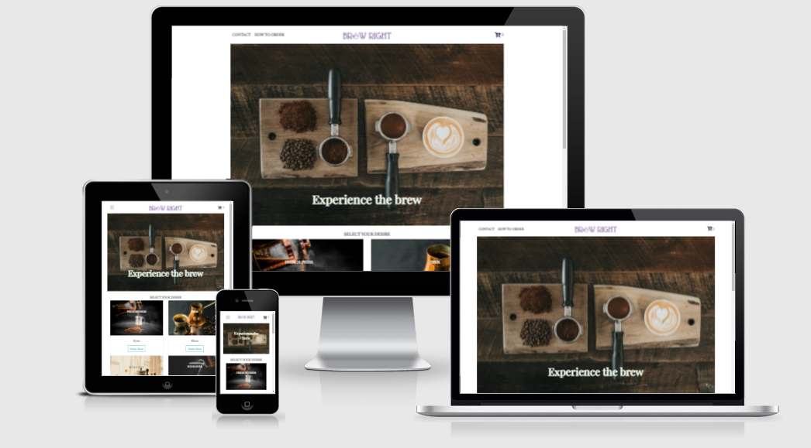

# BREW RIGHT
The primary goal of Brew Right online coffee shop is to offer an ordering platform for coffee lovers - the target audiences. The main idea of this website is to offer a convenient way for the customer to order coffee and provided delivery services straight to the doorstep of the customer's location. 

The website consists of:
* Home Page: Offering options of the coffee varieties offered, their respective price lists, and interactive features to add them to the cart. 
* Order Page: Providing online ordering method and three different branches locations.
* Contact Page: Details of the coffee shop and input from the users for their email address, name, and a text box for their inquiries.
* Cart Page: Showing the item that the user has selected, where they can add or reduce the ordered quantity.

## **User Experience (UX)**

### **Player goals**

* Online coffee shop website that is focusing on selling different distinct flavours of coffee.
* The choices of the coffee offered are visible and easily glanced at once without scrolling down a long page. 
* Eye-catching landing images that suit the theme of the website.
* The preferred item/items can be added to the cart by one click where the click button is situated right under the item so there is no confusion between the prices and items. 
* Fascinating pictures of the products and the products are aligned in a user-friendly manner. 
* The reasons for choosing Brew Right coffee are clearly shown on the home page.
* The availability to add the desire coffee choices to the cart. 
* The details of the coffee shop, including locations, email address, operation hours, and contact number can be found easily via the navigation link at the top of the web page.
* The brief introduction of the website at the footer section in the home page and how to order page, as well as showing the social links.
* The reasons for choosing Brew Right Coffee are shown on the home page.
* Interactive features of adding, decreasing, and removing the products chosen on a specific cart page. 
* The total cost of chosen products is shown and will change as the quantity of the products changed. 

### **Developer goals**
* Well-structured content created from programming that provides a user-friendly webpage of Brew Right Coffee Shop.
* A junior developer using HTML, CSS, Javascript, and Google Map API to showcase the coding skill and as the second portfolio.

### **User Stories**
  1. I want to know the main content and the purpose of the site is trying to show.
  2. I want to know the coffee choices offered which can be seen easily without sliding or scrolling deep down the website. 
  3. I want to know the speciality of the services I can get even though if I am not a coffee lovers.
  3. I want to easily see the price of each type of coffee offered where the products and their respective prices are aligned properly. 
  4. I want to know the speciality of the coffee offered and the delivery method.
  5. I want to locate the different branches of the coffee shops to check the closest location to my place just if I do a walk-in order. 
  6. I want to see their posts on social media to assure credibility. 
  7. I want an easy way to contact the coffee shop where the details are easily visualized on the page. Furthermore, I can write my queries and send them via email, subsequently, they can reply to my email. 
  8. I want the easy and convenient way to add the product that I am desire to order by clicking on the order button. 
  9.  I want to see the quantity that I have ordered on the cart icon on the top page of the website. 
  10. I want to see the list of the products ordered when clicking on the cart icon, which will navigate to a cart page, and shows the total price of the products ordered. 
  11. I want the "add" quantity, "decrease" quantity, and "remove" features of the products showing on the cart page if I decided to change the quantity or want to get rid of a particular product.
  12. I want to know the total amount of the products that I have ordered. 

### **Design Choices**

* Imagery 
    * The background image on the home page is using the image with contents of coffee ground powder, coffee beans, coffee cups and poltafilter. This is to demonstrate the main purpose of the website, which act as a representative element of the website is focusing on. This is to attract the user's attention and yield a trust emotion toward the quality of the beans that the website is offering to the user. 
    * The product images on the home page are the exact coffee brewing types. Hence, the user would have an idea of the coffee brewing mechanism that they are going to order. Each of the products' images has the name labelled thus the user will get to know the types of brewing coffee. 
    * The background on the contact page is using a white tone image with a cup of coffee placing on a table. The purpose of this is to create a relaxing ambience for the user.
    * The landing page image on the how to order page is using a significant ORDER signboard to show the purpose of the page to the user.
* Color Scheme
    * The main colours of the website (except the images) used are generally in white tone. This is because all the images used on the website are generally in an earthy tone since the products are coffee based. Hence, the colours of the images themselves are sufficient to yield colours that are able to enrich the website. 
    * The main home navigation link, which is situated at the top middle of all pages, name: BREW RIGHT, is coloured in dark purple, to make the website's brand stand out from the others navigation link.
    * Dark green is used for the top page of navigation links when the user hovers over the links to present a great contrast to the white tone background. 
    * The navigation links are showing a light green colour when the user is on that particular page, to present which page the user is currently on. 
* Typography
    * Playfair Display font is the main font used throughout the website pages with Sans Serif as the fallback font. 
    * Playfair Display font looks elegant either as a title or the content on a website. It tends to yield a trustable emotion to the user as well which is a vital element for a website business. 
* Styling
    * Each of the links/pages has the same navigation menu so the user can direct to the other navigation sites when they are browsing particular links.

### **Wireframes**

Balsamiq software was used to generate the following wireframes while doing the project planning and scope plan section. 

* [Home](wireframes/home.png)
* [Contact](wireframes/contact.png)
* [How_To_Order](wireframes/how_to_order.png)
* [Cart](wireframes/cart.png)

# **Features**

Each page comprises a responsive navigation bar at the top page. The branding of the website is situated at the top middle, whereas the navigation links are located at the top left. The home page and how to order page consists of the footer with the social media links for the user to click on to check the credit of the website, as well as the other minor section of a brief introduction of the website at the most bottom page. 

The navigation links consist of the home page(represented by the BREW RIGHT logo), contact page, how to order page, and cart page. 

**Home** 

The home page features a main image of the landing page. The reason for this picture is to yield a visual impact to the user which the user can know what is this website selling without spending much time scrolling to look for information. 

The brand of the website, BREW RIGHT, is created by combining wording and pictures to attract the audience's eyes, which acts as a great advertising title. 

The navigation links are in white tone background. Their colour changed when the user hovers the mouse over the navigation links so they know they are clicking on the right link. Navigation links are persistent across desktop and laptop resolution. A menu bar is shown when the screen resolution is at tablet resolution or lower. 

The body content is the products that BREW-RIGHT website is offering to the user. Each of the pictures stands as an individual type of coffee, with the price attaching to each picture so the user gets to know the price of each type of coffee. The images represent and convey the idea of the coffee product that the user will get after ordering. All the products are aligned with each other. The layout of the content of the page in tablet resolution is the same as in laptop and desktop resolution. Whereas, the layout of the content in mobile resolution is aligned vertically to avoid the content get distorted. A link right below of each product named: "Order Now" is shown so the user can order the products if they are willing to. With the products sit on the home page, the user can purchase the products easily without navigating to other pages to look for their desire products, which in turn enhance the sales. 

There is a mouseover event integrated on the "Order Now" button. Whenever the user hovers their mouse over the button, the button will show a different text as in: "Great Choice!", and the button will fill up the cyan colour. The other interactive feature is adding the products to the cart. When the user clicks on the "Order Now" button to purchase the specific coffee, the cart icon on the top right of the page will show the quantity right beside it. It shows the quantity that the user has chosen.  Furthermore, every time the button has been clicked, the windows will pop out an alert message stating: "Your choice has been added to the cart!", so the user knows the product has been added to the cart.   

**How To Order** 

The how to order page features the main image which shows the "ORDER" sign. This image is set at the top of the page so the user can know the purpose of this page. Below the title image is the description that explains the way of ordering on the website. A **Home Page** link is placed in the text so the user can navigate to it easily for ordering the coffee products. 

Three different branches of BREW RIGHT locations are shown in the google map below the page by integrating Google Map API feature. Users can zoom in and zoom out the map to get the exact location of different branches if they want to do a walk into the cafe. 

**Contact**

The contact page features a contact form that giving the option for the users to submit their special requests if they are any. The users can key in their name, email address, and their message. Once the users submit the request by clicking on the submit button named **SUBMIT YOUR REQUEST** right below the contact form, BREW-RIGHT owner will receive the details of the user and their message through the email platform. The page also shows the contact detail of BREW RIGHT, including email address, contact number, main shop address, and opening hours. These details give accessibility for the user to reach BREW RIGHT in an easier way.

**Cart**

The cart page show users the item/items they have chosen.  The properties include:
1. Item
2. Price
3. Quantity 
4. Total Price

These properties are aligned horizontally which stand as the header. Once the user has chosen an item on the home page, the properties of the item will show on this cart page which appears in table form. The user can interact with the buttons. These buttons are the *Trash Bin*, *Minus*, and *Add*.

*Trash Bin*: Delete the entire item and its properties.
*Minus*: Reduce the quantity of a particular chosen item in the cart.
*Add*: Add the quantity of a particular chosen item in the cart.

There is a **Total** amount shows below the chosen item, which shows the total cost of the item in the users' cart. Whenever the user adds, decrease, or remove the item, the total amount will calculate to the correct final total value. 

**404 Page**

The 404 page is created if there is a non-existent page or resource, user can redirect back to the home page/index.html by clicking on the link provided on the page.

### **Existing Features**

* Header Brand - Appears on every page. It allows the users to spot it easily since it is placed at the top middle of the webpage.
* Header Navigation Bar - Appears on every page. It allows the users to navigate to different web pages and access their content. 
* Hover: 
    1. Appears on the navigation bar. The style of each link changes upon the user's mouse pointer interaction when they hover their cursor over it or clicking it. 
    2. Appears on the order button in the middle of the home page for each product. The text will change from *Order Now* to *Great Choice!* and the box will fill with *cyan* colours.
* Cart icon quantity - Appears on every web page. The initial of the cart icon quantity is showing *0* 
    before the users click on the order button. Once the users have clicked on the order button, the cart quantity will add up and show the current cart quantity. These features aim to give a sense to the users if they have ordered the desire quantities. The cart quantity will be consistent across different web pages.
* Alert window - Appears on the home page and contact page. On the home page, the alert window will pop out the message stating *Your choice has been added to the cart!* once the users have clicked on the order button of the product. This feature is to convey the message to the users that the item clicked has been added to their cart. On the contact page, once the users have typed in their name, email address, the text of the request, and clicking on the submit button, the alert window will pop out the message stating *You had submitted your request. We will get back to you soon!"*.
* Google map - Appears on the how to order page. These features show the three branches location of the BREW RIGHT coffee shop with three pinpoints.
* Add, reduce, remove of product - Appears on the cart page. These features allow the users to adjust the quantity or remove the chosen product if they change their minds. Users can interact with those buttons. 
* Footer Social Icons - Appears on the home page and how to order page. It allows the users to browse the social media platform that BREW RIGHT uses. 
* Contact Info - Appears on the contact page. It allows the users to reach BREW RIGHT via call, email, or walk-in to the coffee shop. (!set as link for number and email!) 

* [Contact Page](https://github.com/kenweechin/BREW-RIGHT/blob/main/contact.html) - Allow users to know the contact details and submit their special request.
* [How To Order Page](https://github.com/kenweechin/BREW-RIGHT/blob/main/how_to_order.html) - Allow users to know how to order the coffee either via website or walk-in by showing a thorough description of text and google map locations.
* [Cart Page](https://github.com/kenweechin/BREW-RIGHT/blob/main/cart.html) - Allow users to adjust the chosen product quantity and know the total amount. 

### **Features left to implement**
* Subscriber opt-in pop-up screen - Allow all new users to have an option to sign up for the email newsletter to receive any announcement from BREW RIGHT.
* Payment option - Allows users to choose the online payment. 
* Feedback pop up form - Use to capture insights of the user experience.

# **Technologies Used**
* HTML, CSS, and javascript programming languages are used in this project.
* The developer uses [Gitpod](https://www.gitpod.io/) for their integrated development environment (IDE) which can be launched from [Github](https://github.com/) to build the website.
* [BoostrapCDN](https://www.bootstrapcdn.com/) - Used to provide website's structure and makes the website to be responsive across different screen resolution. Furthermore, it provides icons from [FontAwesome](https://www.bootstrapcdn.com/fontawesome/).
* [Google Fonts](https://fonts.google.com/) - *Playfair Display* font family were imported to style the website fonts.
* [jQuery](https://jquery.com/) - For responsive navbar. 
* [Popper.js](https://popper.js.org/) - For responsive navbar. 

# **Testing**
Testing documentation is created in [TESTING.md file](https://github.com/kenweechin/BREW-RIGHT/blob/main/TESTING.md)

# **Deployment**
This project is developed using [Gitpod](https://www.gitpod.io/), committed to git, and pushed to [GitHub](https://github.com/) via the build-in function in gitpod. The detailed steps are stated as below:
1. Git add filename - This command was used to add selected files to the staging area before committing. 
2. Git commit -m *commit message stating the updates* - This command was used to commit changes to the local repository. 
3. Git push - This command is used to push all committed changes to Github repository and all the files are safe.  

The steps to deploy the page to Github Pages from its GitHub repository are shown as below:
1. Log in to Github.
2. Choose **kenweechin/BREW-RIGHT** from the list of the repository.
3. Click on **Setting** on the right of the menu section near the top page.
4. Navigate to the **Pages** in the left sidebar and click on it.
5. Under **GitHub Pages**, use the **Branch** dropdown menu, then select Main Branch. 
6. Click on **Save** button on the right, and the website is now deployed. 

### **The methods to run this project locally**
1. Follow this [link](https://github.com/) to create an account if you don't have one yet. 
2. Make sure to use the Chrome browser when you are working on Github and Gitpod.
3. Subsequently, install the [Gitpod Browser Extension](https://www.gitpod.io/docs/browser-extension/) and restart the Chrome browser after that. 
4. Once the installation is done, log in to your [Gitpod](https://www.gitpod.io/) and navigate to [Project Github Repository](https://github.com/kenweechin/BREW-RIGHT).
5. Click on the *green* colour "Gitpod" button located near the top right of the page. This will create a new gitpod workspace generated from github, and you are free to work on it locally.

### **Cloning a repository to Github Desktop**
1. Navigate to the main page of the repository on Github. 
2. Click on the "Code" drop-down button.
3. Click "Open with Github Dekstop" to clone and open the repository with Github Desktop. 
4. Follow the prompts in Github Dekstop to finish the clone. 

# **Credits**

### **Website**
* The general concept and idea were inspired by [Origo Coffee](https://origocoffee.ro/).

### **Content**
* The text of the *About Us* section on the home page and how to order page was taken and edited from [theBrandyBoy](https://thebrandboy.com/). 
* The styling of the contact page was taken and edited from [CodingSnow](https://www.youtube.com/c/CodingSnow) channel.

### **Media**
* The photos used in this project were taken from [Unsplash](https://unsplash.com/), the internet’s source of freely-usable images.

### **Code**
* The google Maps feature on how to order page is derived and edited from the google maps platform. 
* The local storage property which used to store key-value pairs in a web-browser, setCoffeeProducts function and cartDisplay function in script.js are derived from [TelmoSampaio](https://www.youtube.com/channel/UCADAkBGiLWIPkCu8D1R1M6g).

### **Logo**
* BREW RIGHT logo was created by using [TRUIC](https://howtostartanllc.com/logo-maker) which is free to use.  

### **Acknowledgement**
* I have the inspiration of creating this project from my passion for coffee. I am keen on different types of coffee brewing types. 
* Special thanks to my mentor, Mr Spencer for valuable suggestions on the project and the way to improve them. 