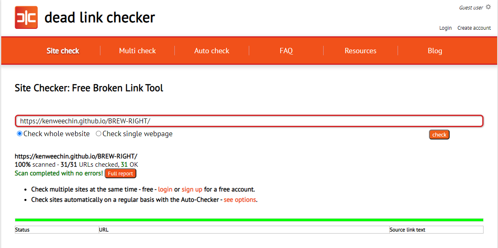
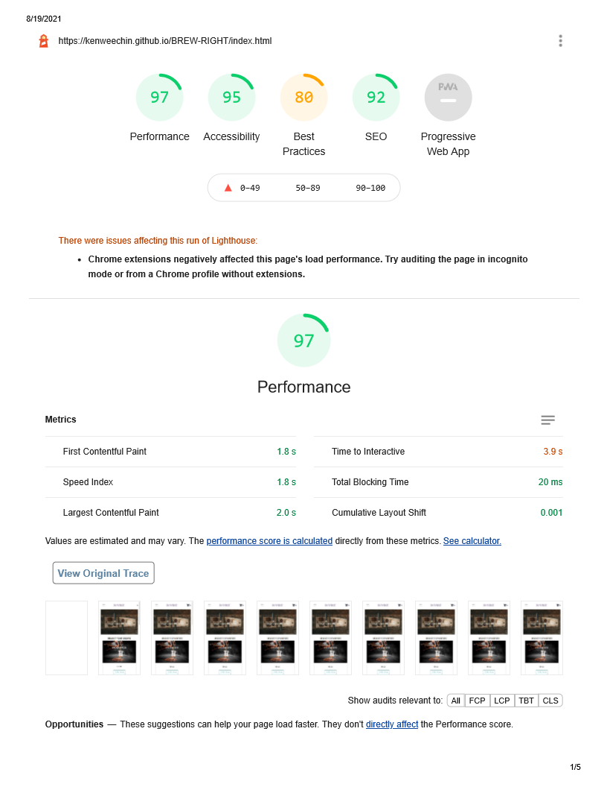
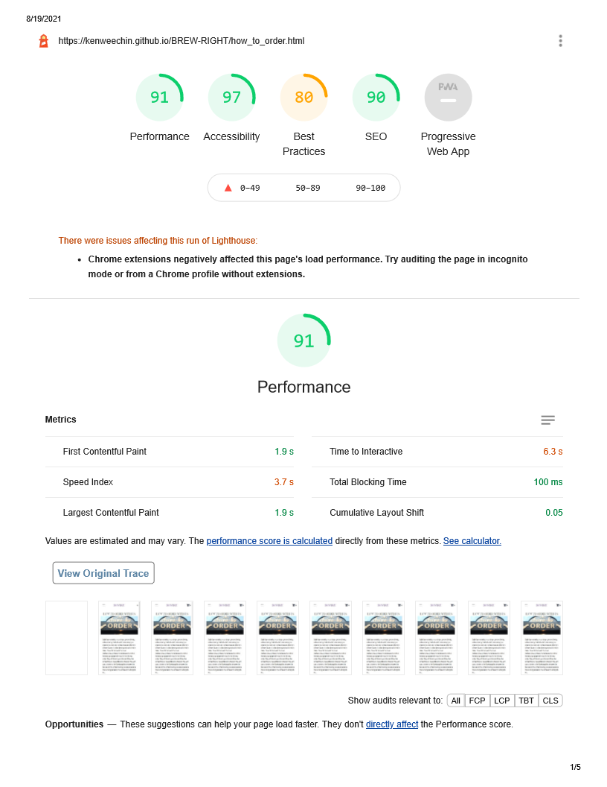
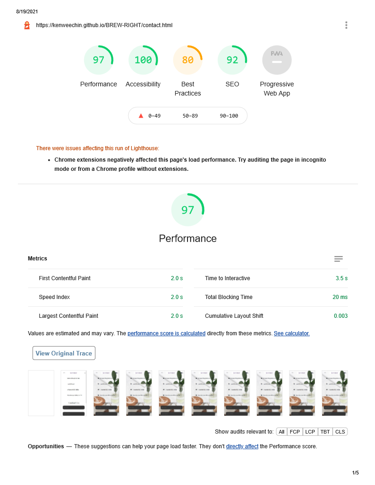
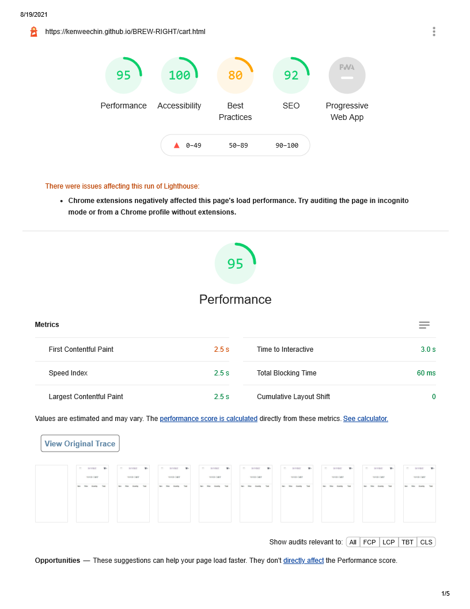
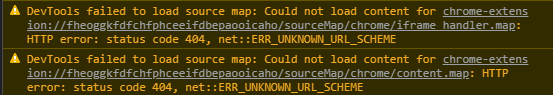
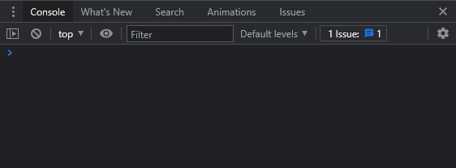
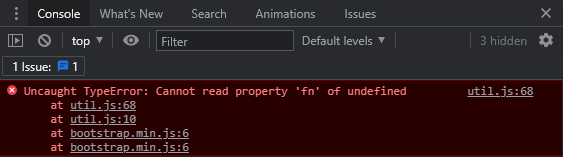

# Brew Right - Testing details
* [Main README.md file](https://github.com/kenweechin/BREW-RIGHT/blob/main/README.md)
* [Website on Github Pages](https://github.com/kenweechin/BREW-RIGHT)

# Testing
* [W3C Markup Validation](https://validator.w3.org/)
* [W3C CSS Validation](https://jigsaw.w3.org/css-validator/)
    * W3C Markup Validation and W3C CSS Validation were used by the developer to validate HTML and CSS code of the website.
* [Jshint](https://jshint.com/)
    * Jshint tool was used by the developer to validate the javascript code of the website.
* The project was tested and verify there is no broken link as shown by the image below: 

* The following images are the lighthouse testing score for all the html pages.

### **Client Stories Testing Section.**

* The pathway across the website is shown as below: 
    * Home -> Contact -> How To Order -> Cart
    * Each page shows the exact information that the developer wants the clients to receive. The sticky-top feature of the navigation links are not utilized to conserve the space that the user is looking at, on the other hand, the overall web pages are not having congested content, so the user can easily scroll to the top to navigate to other links. 

* Testing from UX section of README.md
    1. As a new visitor to the webpage, I would like to know: 
        * The main content of the website is trying to show without spending much time scrolling or reading the web page. 
        * The name/brand of the shop is apparent at the time I have landed on the web page. 
        * A landing image that is relevant to the nature of the shop. 
        * The home page link is easy to locate at the top middle, which leads back to the main page. 
    
    2.  As a new visitor to the webpage, I would like to know what are the coffee types offered: 
        * The coffee types are visible on the home page.
        * The prices of each coffee type are visible adjacent to the products and there is no confusion between the products and prices.
        * The delivery method by ordering via the website which can be found on the how to order page. 
        * The location of different branches of Brew Right coffee shop if I want to do a walk-in order. 
    
    3. As a potential client, I would like to know Brew Right's credibility:
        * The social media links are accessible at the bottom of the home page. 
        * A description introduce Brew Right itself in the food and beverage industry at the bottom of the home page. 
    
    4. As an interested client, I would like to know the ordering method of their products.
        * There is a thorough description on the how to order page, where the link can be seen easily at the top left of the web page. The description explains the steps of ordering. 
    
    5. As an interested client, I would like to know the method to contact Brew Right.
        * Text forms are shown on the contact page where the client can key in their full name, email address, and their typed-in special request. Brew Right can receive the request sent by the client and subsequently meeting the client's requirement. 
        * The contact details of Brew Right are shown on the contact page. 
    
    6. As an interested client, I want an easier way to add my desire products.
        * Order buttons exist for each type of coffee. 
        * The product will be added to the client's cart once they click on the order button.
        * The cart quantity is shown right beside the shopping cart icon. 
    
    7. As an interested client, I want to interact with my chosen products in terms of adjusting or removing the products.
        * Clients can click on the shopping cart icon on the top right of the web page, subsequently, lead to the cart page.
        * Clients can either click on the "add", "reduce", or "remove" button to adjust the quantity of the product.
        * Clients can see the total price after everything is set. 

### **Manual testing of all functionality and elements on every page created.**  
* Home Page:
    1. Navigation bar:
        * Go to the "Home" page in a desktop resolution.
        * Adjust the screen size from desktop to tablet to validate the contact and how to order navigation links changes from a normal static alignment into a toggle menu bar. Ensure all the menus stay at a consistent width between each other. Furthermore, also verify the texts are aligned in the centre without changing their position.
        * Checking there is no overflow for each inline menu that causes themselves to extend outside the navigation bar. 
        * Hover over the contact and how to order navigation links and verify those links change colour to indicate the pointing of the cursor.
        * Click on the "BREW RIGHT" logo to verify the click links to the home / main page. 
        * Click on each navigation menu (contact, how to order, cart icon) to verify each link are navigate to the correct page.
        * Reduce the screen resolution to the smallest mobile screen resolution (320 x 570) and verify the right and left padding of the navigation menus are having equal spacing to the edges of the window.
        * In the small screen resolution, verify the logos are centred and the texts font size are reduced slightly smaller centred as well.
        * Repeat responsiveness and testing functionality verification for mobile resolution. 

    2. Background image of landing page:
        * Go to the "Home" page in a desktop resolution.
        * Verify the image contain the landing page. 
        * Verify the text "Experience the brew" aligned at the center of the main image.
        * Reduce the screen size and the image containment retain.
        * Repeat responsiveness and testing functionality verification for mobile resolution. 

    3. Product images:
        * Go to the "Home" page in a desktop resolution.
        * Checking the product images are aligned in a 2 x 2 layout. 
        * Reduce the screen resolution to tablet screen size and verify the modules images remain in the same position and spacing.
        * Verify the buttons "Order Now" for each product having hovering interaction features. The text of the buttons change from "Order Now" to "Great Choice!", and the buttons filled up will cyan colour. 
        * Click on the "Order Now" button for each product, verify the alert message pops out stated: "Your choice has been added to the cart!"
         * Verify the shopping cart quantity changes/added whenever the "Order Now" button has been clicked.
        * Reduce the screen resolution to mobile screen size and verify the product images are now aligned on top of each other instead of side by side, and the sizes change accordingly as to the screen resolution.
        * Verify the position of the product images is centre aligned in mobile screen size with equal blank space on each side.

    4. Footer:
        * Go to the "Home" page in a desktop resolution.
        * Hover over to the social media links verify they are opening up a separate tab by clicking on them.
        * Reduce window to mobile screen size and verify the "Social Media" section is lying on top of the "About Us" section.
        * Verify the social links are remain inline as the width of windows reduced.

    5. Favicon:
        * Verify the favicon exists. 
    
    6. Cart Quantity:
        * Verify the shopping cart quantity remains the same as the contact page, how to order page and cart page.

* Contact Page:
    1. Navigation bar: 
        * Verify the navigation link "CONTACT" is highlighted in green colour.
        * The remaining navigation bar code is the same on all HTML pages. Testing is verified and done.

    2. Background image:
        * Verify the background image fully contain the page. 
        * Reduce the screen size and the image containment retain.
    
    3. Page content:
        * Verify the contact details section and "Contact Us" form section are aligned side by side at the same row of the page.  
        * Adjust the width of the window to verify the text's position are remain in the  container from desktop to tablet screen resolution, and they do not overflow when the screen size is reduced. 
        * Reduce the screen size to mobile resolution and verify the contact detail section is lying on top of the "Contact Us" section. 

    4. Contact form: 
        * Testing 1: Submit empty form and verify that an error appears showing fill up is required.
        * Testing 2: Submit an invalid email address and verify that an error shows up indicating a proper format is required.
        * Testing 3: Submit a name, valid email address, and text, verify the alert message pops out stated: "You had submitted your request. We will get back to you soon!". 
        * Testing 4: Verify Brew Right receive the request sent by the client, including the information of the client's name, the client's email address, and their written request. 
        * Testing 5:  Verify the button "SUBMIT YOUR REQUEST" has the hovering interaction features. The colour of the buttons changes from orange to purple after clicking or hovering.

    5. Favicon:
        * Verify the favicon exists. 
 
    6. Cart Quantity:
        * Verify the shopping cart quantity remains the same as to the home page, how to order page, and cart page.

* How To Order Page:
    1. Navigation bar: 
        * Verify the navigation link "HOW TO ORDER" is highlighted in green colour.
        * The remaining navigation bar code is the same on all HTML pages. Testing is verified and done.

    2. Background image:
        * Verify the background image contain the upper section of the page. 
        * Reduce the screen size and verify image containment retain, left and right spacing to the window edge retain.

    3. Text content:
        * Verify the text has equal spacing on the left and right of the page when reducing the screen resolution. 

    4. Google Map:
        * Verify the zoom in, zoom out, and expand features are working in laptop, tablet, and mobile screen resolution. 
        * Verify the three pinpoint locations are visible without clicking on the zoom in and zoom out button. 

    5. Footer:
        * The remaining footer code is the same on all HTML pages. Testing is verified and done.

    6. Favicon:
        * Verify the favicon exists. 

    7. Cart Quantity:
        * Verify the shopping cart quantity remains the same as the home page, contact page, and cart page. 

* Cart Page:
    1. Navigation bar: 
        * The navigation bar code is the same on all HTML pages. Testing is verified and done.

    2. Table Content:
        * Verify the table header exist either the product has or has not been added to the cart.
        * Verify the table cell has equal spacing when the screen resolution is higher than 768 x 570. 
        * Verify the products added and their value (Name, Price, Quantity, Total) are the same as when the client clicked on the home page.
        * Verify the remove button (Bin) is working, which delete the particular product row, and cart quantity at the top right of the page changes, and the total amount below the table content changes respectively as well. 
        * Verify the "reduce" and "increase" button under the "Quantity" column works. When the quantity is at "1", and by clicking on the "reduce" icon, no further action proceeds which may lead to a negative value; whereas, by clicking on the "increase" icon, the particular product's quantity increases, same goes to it's total in the product row, and the final total amount below the table cell.  
        * The alignment of the table and its content retain from desktop to mobile screen resolution. 

    3.  Favicon:
        * Verify the favicon exists. 
    
    4. Cart Quantity:
        * Verify the shopping cart quantity remains the same as to the home page, contact page, and how to order page. 

### **Bug/Fixes** 
1. An error showing in the console section in Chrome Dev Tools as shown in the image below:

* These errors were solved by ticking the "Selected Context Only" option in Developer tools setting, under console section. Those errors were hidden as shown in the image below:

    

2. An error showing in the console section in Chrome Dev Tools as shown in the image below:

* These errors were solved by updating the version of Jquery, Popper, and Boostrap, and their script order. Those errors were hidden as shown in the image below:

    

